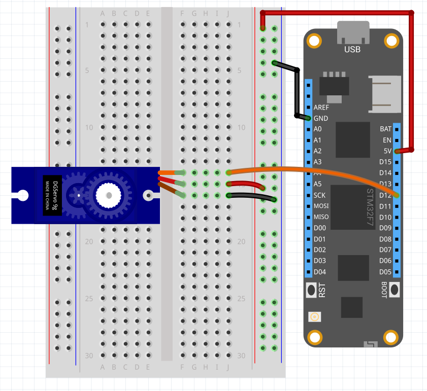
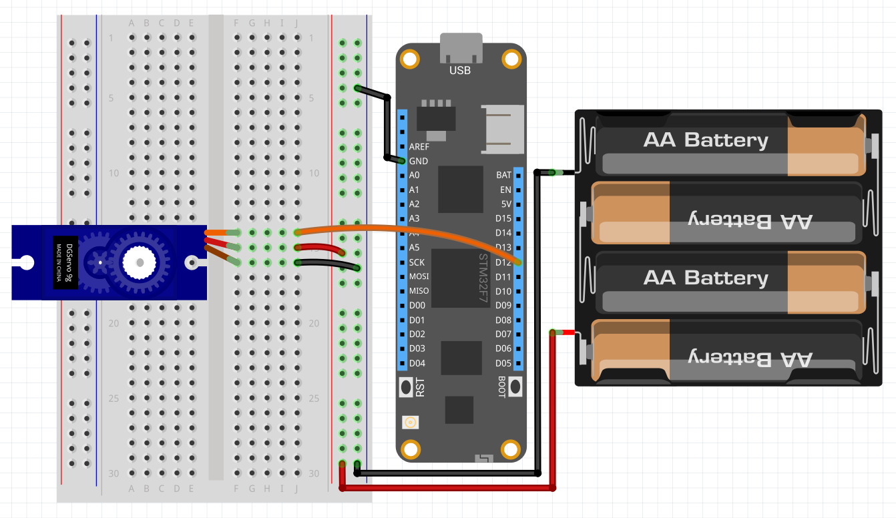

| Servo         |             |
|---------------|-------------|
| Status        |  |
| Source code   | [GitHub](https://github.com/WildernessLabs/Meadow.Foundation/tree/master/Source/Meadow.Foundation.Peripherals/Servos.Servo.Core) |
| NuGet package |  |

Servos are integrated packages that usually include a DC electric motor, torque-increasing gearing, and electronics to control the motor: 


The gained their popularity as an important part of remote controlled cars, airplanes, and such, but are now also very common in robotics.

Unlike simple electric motors, they have three wires, with two wires supplying power, and the third wire accepting a [PWM](http://developer.wildernesslabs.co/Meadow/Input_Output/Digital/PWM/) control signal.

### Types of Servos

There are two types of servos; _fixed-angle_ servos, and _continuous rotation_ servos. 

#### Fixed-Angle Servos

Fixed angle servos are by far the most common type of servo, and usually what people mean when they use the term servo. They can only move within a given range, most commonly between 0º and 180º. The integrated electronic control system in a servo allows them to be controlled very precisely, so that you can set them to turn to a specific angle. 

#### Continuous Rotation Servos

Continuous rotation servos are sometimes known as _winch_ servos, because they were originally used as winch controls on remote control sailboats. They don't have any restriction on their angle of movement, but instead will rotate in either clockwise or counter-clockwise direction at a set speed.

### Control Signal

Both fixed-angle and continuous rotation servos are controlled with a PWM signal, and the duration of the duty cycle pulse determines their behavior. 

Every servo has a _minimum pulse duration_ and a _maximum pulse duration_ that they respond to. A control signal outside of this range will usually be ignored by the servo. The ideal standard is a minimum of `1.0ms` and a max of `2.0ms`, but in practicality, many servos have a much wider range of operation. Additionally, because the pulses vary between fractional milliseconds, µseconds (1,000 milliseconds) are usually used as the unit. So a `1.0ms` pulse is `1,000µs`.

#### Fixed Angle Control

For fixed-angle servos, the minimum pulse duration will cause them to rotate to their minimum angle (nominally 0º), and the maximum pulse duration will rotate them to their maximum angle. So for instance, the following table describes the rotation of a `180º` servo that has a pulse range of `1,000µs` to `2,000µs`:

| Control Pulse | Angle   |
|---------------|---------|
| `1,000µs`     | `0º`    |
| `1,500µs`     | `90º`   |
| `2,000µs`     | `1800º` |

#### Continuous Rotation Control

Continuous rotation servos still have a minimum and maximum pulse durations, but they work a little differently. At the midpoint between those extremes, a control signal will actually stop the servo, and anything less than that midpoint will cause it to rotate clockwise, and anything more than that midpoint will cause it to rotate counter-clockwise. And the distance from that midpoint controls the speed of rotation. For example, the following table describes rotation and speed of various control signals:

| Pulse Duration | Rotation Direction | Speed |
|----------------|--------------------|-------|
| `1,000µs`      | Clockwise          | 100%  |
| `1,250µs`      | Clockwise          | 50%   |
| `1,500µs`      | None               | n/a   |
| `1,750µs`      | Counter-Clockwise  | 50%   |
| `2,000µs`      | Counter-Clockwise  | 100%  |

### Powering Servos

Servos can draw a lot of current, especially under load. Additionally, most common hobby servos require `6V`. For this reason, an external power supply should be used when they're used in practical applications.

For just testing however, they can be powered via the `5V` rail on the Meadow as follows:

### Testing Circuit



### External Power Circuit

When powering with an external power source, you must connect the external `GND` to the `GND` rail on the Meadow (as shown in the following schematic and breadboard illustration), or the PWM control signal will not work:



In the above illustration, (4), AA batteries are used, but we usually use a power supply like the following:


The female plug adapter shown above can be found on [Amazon](https://amzn.to/2r7o20B).

## Cable Colors

Servo cable colors vary by manufacture, but they're always in the same order. The `GND` pin is the first pin by convention is always the darkest:

| Pin | Signal  | Futaba Colors | HiTec Colors    | JR Colors |
|-----|---------|---------------|-----------------|-----------|
| 1   | GND     | Black         | Black           | Brown     |
| 2   | VCC     | Red           | Red or Brown    | Red       |
| 3   | Control | White         | Yellow or White | Orange    |

The following example shows how to control the movements of a servo:

```csharp
public class MeadowApp : App<F7Micro, MeadowApp>
{
    readonly IPwmPort pwm;
    readonly Servo servo;

    public MeadowApp() 
    {
        pwm = Device.CreatePwmPort(Device.Pins.D12);

        servo = new Servo(pwm, NamedServoConfigs.Ideal180Servo);

        TestServo();
    }

    void TestServo()
    {
        while(true)
        {
            if (servo.Angle <= servo.Config.MinimumAngle)
            {
                Console.WriteLine($"Rotating to {servo.Config.MaximumAngle}");
                servo.RotateTo(servo.Config.MaximumAngle);
            }
            else
            {
                Console.WriteLine($"Rotating to {servo.Config.MinimumAngle}");
                servo.RotateTo(servo.Config.MinimumAngle);
            }
            Thread.Sleep(4000);
        }
    }
}
```

[Sample projects available on GitHub](https://github.com/WildernessLabs/Meadow.Foundation/tree/master/Source/Meadow.Foundation.Peripherals/Servos.Servo.Core/Samples/) 
